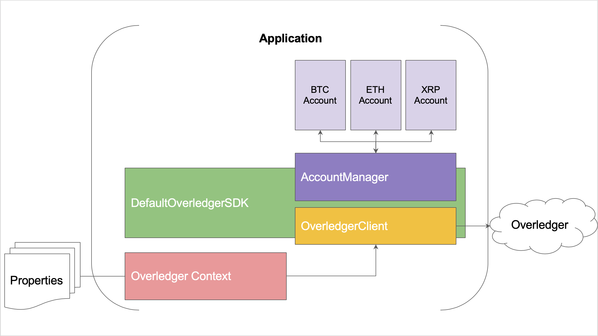

[](https://opensource.org/licenses/Apache-2.0)
[](https://maven-badges.herokuapp.com/maven-central/network.quant/overledger-sdk-java)

# Overledger Java SDK

Developer's guide to use the Overledger SDK written in Java by Quant Network.

## Introduction to the Overledger SDK

Overledger is an operating system that allows distributed apps (MApps) to connect to multiple distributed ledger technologies (DLTs) or blockchains. The Overledger SDK allows developers to create signed transactions & send them simultaneously to all supported DLTs.

## Technologies

The Overledger SDK is maven compatible dependency written in Java

### Overledger SDK Structure


### Overledger SDK Working Flow



## Prerequisites

- Register for a free developer account on [Quant Developer's Portal](https://developer.quant.network)
- You will require MAppId and access key:
  - Enter information regarding your application in order to get a MApp ID.
  - Verfify your Quant token, and create a access key.

## Installation

Developers would have to install the Overledger SDK as a maven dependency.

```xml
<!-- SDK bundle -->
<dependency>
    <groupId>network.quant</groupId>
    <artifactId>overledger-sdk-bundle</artifactId>
    <version>1.0.0-alpha.1</version>
</dependency>
```

### Tailored installation

When a full implementation of all dependencies is not required, it can be tailored to only implement those services that will be utilised.

#### [overledger-sdk-api](./overledger-sdk-api/README.md)

API module defines Overledger SDK interfaces.

#### [overledger-sdk-essential](./overledger-sdk-essential/README.md)

This module gives a basic implementation of Overledger SDK API.

#### [overledger-sdk-bitcoin](./overledger-sdk-bitcoin/README.md)

This module contains Bitcoin implementation of Overledger Account API.

#### [overledger-sdk-ethereum](./overledger-sdk-ethereum/README.md)

This module contains Ethereum implementation of Overledger Account API.

#### [overledger-sdk-ripple](./overledger-sdk-ripple/README.md)

This module contains Ripple implementation of Overledger Account API.

#### [overledger-sdk-bundle](./overledger-sdk-bundle/README.md)

This module bundles up API, essential, Bitcoin, Ethereum and Ripple modules.

## Getting started

* Follow [README](./overledger-sdk-api/README.md) from overledger-sdk-api to create context.properties.

* Then load properties into OverledgerContext
```
OverledgerContext.loadContext(...);
```

* Instance OverledgerSDK Object, add accounts, and call Overledger SDK methods.
```java
public class OverledgerSDKExample {
    
    private OverledgerSDK overledgerSDK;
    
    public OverledgerSDKExample(Account... accounts) {
        this.overledgerSDK = DefaultOverledgerSDK.newInstance(NETWORK.MAIN);
        this.overledgerSDK.addAccount(DLT.bitcoin.name(), accounts[0]);
        this.overledgerSDK.addAccount(DLT.ethereum.name(), accounts[1]);
        this.overledgerSDK.addAccount(DLT.ripple.name(), accounts[2]);
    }
    
    public OverledgerTransaction writeTransaction(OverledgerTransaction ovlTransaction) {
        return this.overledgerSDK.writeTransaction(ovlTransaction);
    }
    
}
```

### Further information

This SDK acts as library for embedding in an application, and facilitates the execution and access of Quant Network's Overledger.

Refer [wiki](https://github.com/quantnetwork/overledger-sdk-java/wiki) for more Details.

| Stable Release Version | JDK Version compatibility | BPI Version compatibility | Release Date |
| ---------------------- | ------------------------- | ------------------------- | ------------ |
| 1.0.0-alpha            | 11+                       | 1.0.0-alpha               | \*30/10/2018 |
| 1.0.0-alpha.1          | 11+                       | 1.0.0-alpha.1             | \*17/12/2018 |

## Release notes

| Release         |                        Notes                                       |
| --------------- | :----------------------------------------------------------------: |
| 1.0.0-alpha     | [v1.0.0-alpha release notes](docs/release_v1.0.0-alpha_notes.md)   |
| 1.0.0-alpha.1   | [v1.0.0-alpha.1 release notes](docs/release_v1.0.0-alpha.1_notes.md) |
