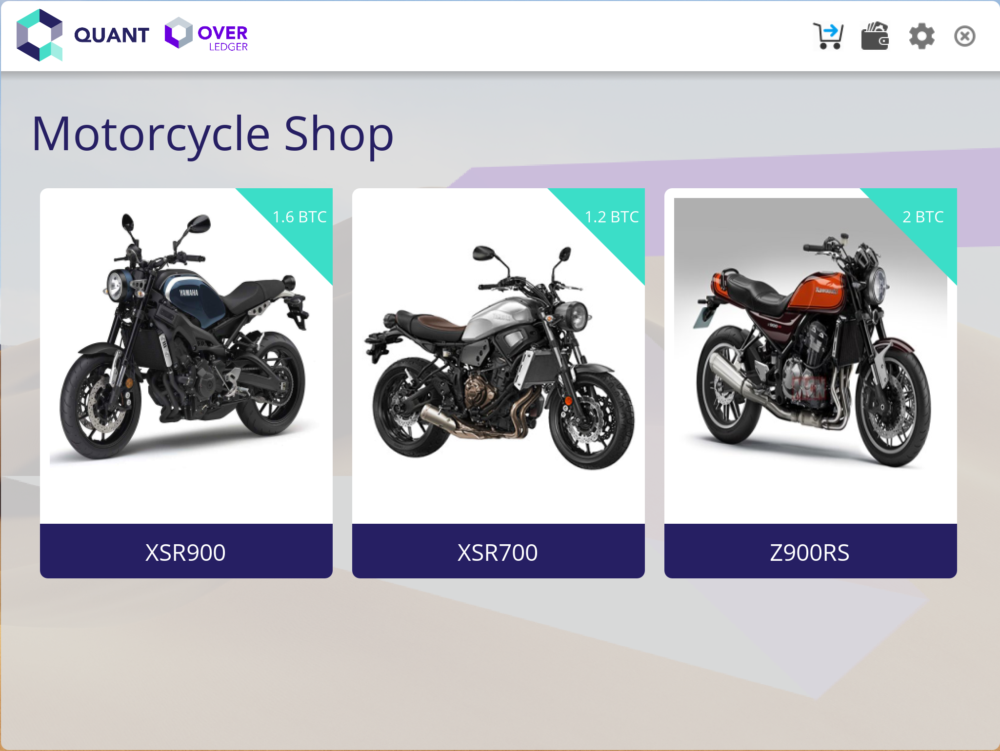
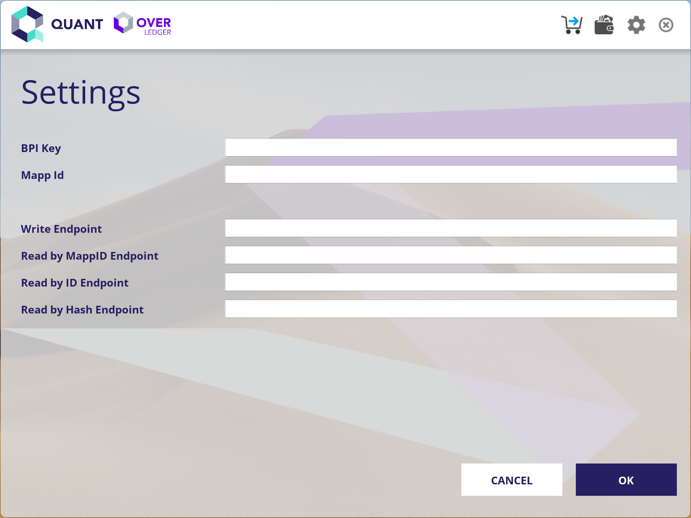
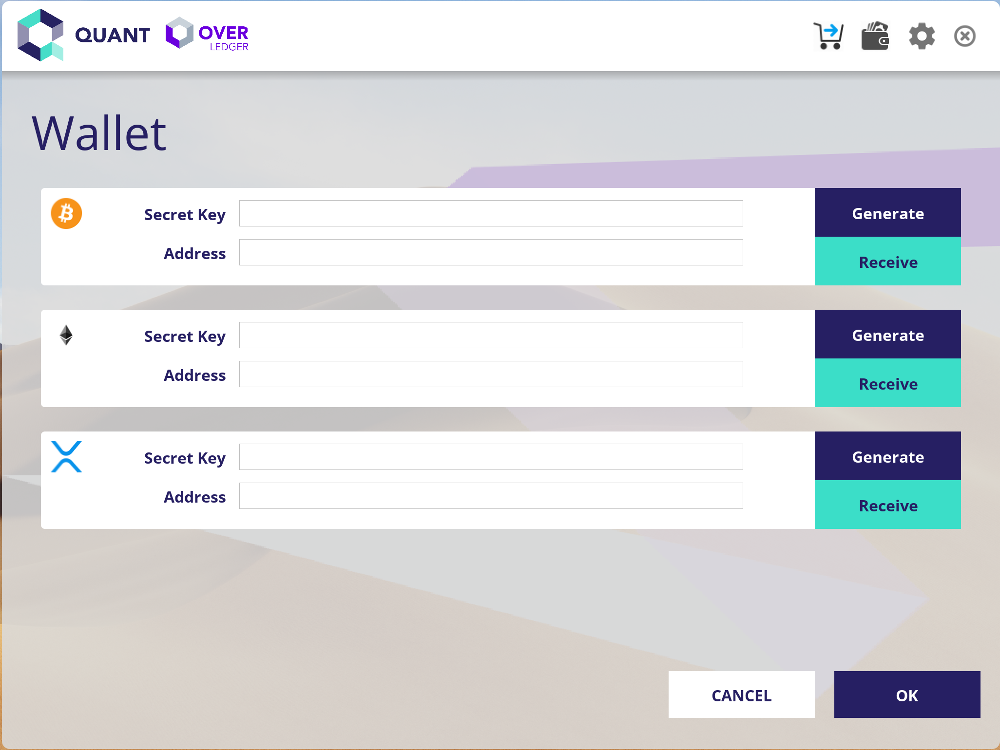
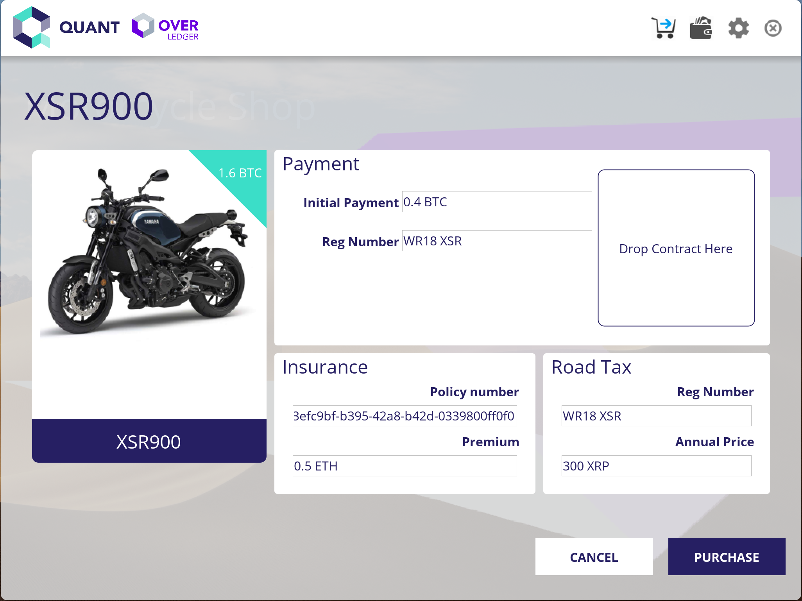

# overledger-sdk-example

This module gives a sample project of using Overledger SDK for Java.

This project use a simple Java Swing application to demonstrate how to use Overledger SDK for Java.
[OverledgerSDKHelper](./src/network/quant/sdk/OverledgerSDKHelper.java) contains all methods and parameters for accessing Overledger SDK.

## How to run example application

Run main method under [OverledgerEntryPoint](./src/network/quant/OverledgerEntryPoint.java)

## How to use example application

From main page, you can access all options over the top right corner of the GUI

In settings page, you can setup endpoints for BPI level access. Or you could load properties file by dragging file into this panel.

In Wallet page, you can create or set your DLT acount/wallets, "Receive" button is ONLY used for receive test fund from Overledger development faucet.

 
Go to purchase panel by clicking items at main page, from this page, you could modify transaction details, also you can drag a file into a marked area.
Maximum accept file size is 50KB.
